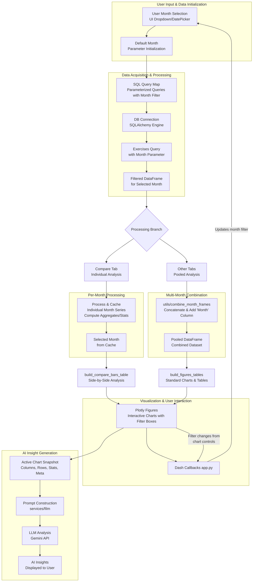

```mermaid
flowchart TD
    %% ==================== USER INPUT & INITIALIZATION ====================
    subgraph A [User Input & Data Initialization]
        direction LR
        A1[User Month Selection<br>UI Dropdown/DatePicker]
        A2[Default Month<br>Parameter Initialization]
    end

    A1 --> A2

    %% ==================== DATA ACQUISITION & PROCESSING ====================
    subgraph B [Data Acquisition & Processing]
        B1[SQL Query Map<br>Parameterized Queries with Month Filter]
        B2[DB Connection<br>SQLAlchemy Engine]
        B3[Exercises Query<br>with Month Parameter]
        B4[Filtered DataFrame<br>for Selected Month]
    end

    A2 --> B1
    B1 --> B2
    B2 --> B3
    B3 --> B4

    %% ==================== DATA FLOW BRANCH ====================
    B4 --> C{Processing Branch}

    C --> D[Compare Tab<br>Individual Analysis]
    C --> E[Other Tabs<br>Pooled Analysis]

    %% ==================== COMPARE TAB PATH ====================
    subgraph D1 [Per-Month Processing]
        D2[Process & Cache<br>Individual Month Series<br>Compute Aggregates/Stats]
        D3[Selected Month<br>from Cache]
    end

    D --> D2
    D2 --> D3
    D3 --> F[build_compare_bars_table<br>Side-by-Side Analysis]

    %% ==================== POOLED TABS PATH ====================
    subgraph E1 [Multi-Month Combination]
        E2[utils/combine_month_frames<br>Concatenate & Add 'Month' Column]
        E3[Pooled DataFrame<br>Combined Dataset]
    end

    E --> E2
    E2 --> E3
    E3 --> G[build_figures_tables<br>Standard Charts & Tables]

    %% ==================== VISUALIZATION & INTERACTION ====================
    subgraph H [Visualization & User Interaction]
        H1[Plotly Figures<br>Interactive Charts with Filter Boxes]
        H2[Dash Callbacks app.py]
    end

    F --> H1
    G --> H1
    H1 --> H2

    %% ==================== AI ANALYSIS PATH ====================
    subgraph I [AI Insight Generation]
        I1[Active Chart Snapshot<br>Columns, Rows, Stats, Meta]
        I2[Prompt Construction<br>services/film]
        I3[LLM Analysis<br>Gemini API]
        I4[AI Insights<br>Displayed to User]
    end

    H1 -- "Filter changes from<br>chart controls" --> H2
    H2 -- "Updates month filter" --> A1
    H1 --> I1
    I1 --> I2
    I2 --> I3
    I3 --> I4
```